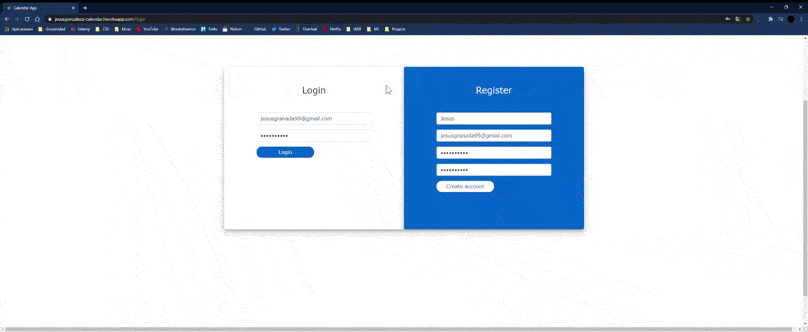

# Calendar App frontend
This the calendar app frontend. \
You can login, register and create, delete, update and list the events from the\
calendar. You need an account to do all the operations. You can only delete and update your events. \
On the other hand, you can see others' events. This is a very helpful tool for teams.

:warning: **I may have deleted the connection. See the backend and create yours in that case** 
https://github.com/JesusGonzalezA/CalendarApp_Backend

https://jesusgonzaleza-calendar.herokuapp.com/login \
https://jesusgonzaleza.github.io/login

## :star: What I've learnt...

:+1: React js \
:+1: Redux \
:+1: Fetch from an API \
:+1: JWT token \
:+1: Components from the community (calendar) \
:+1: Date, moment... \
:+1: Custom alerts \

